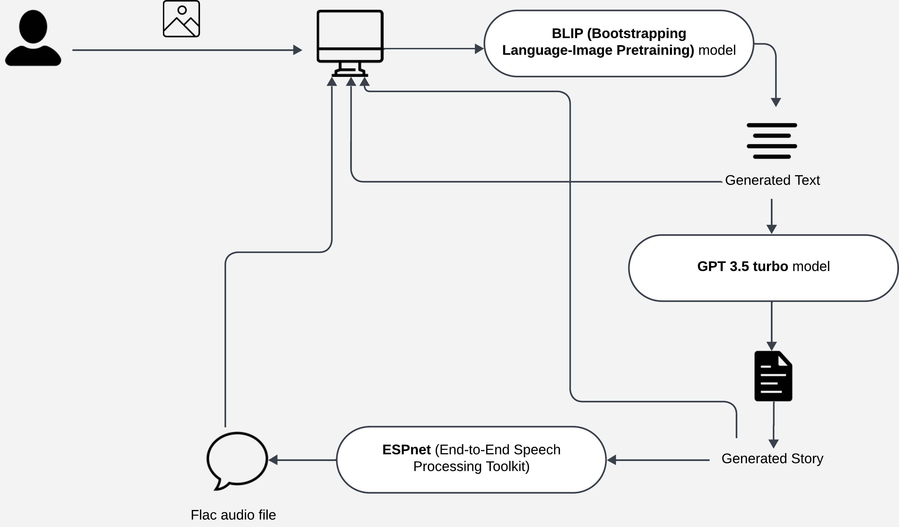

## GenAI Image-to-Speech Tool
The GenAI Image-to-Speech Tool is a streamlit web app that transforms images into speech through a multi-step AI-powered process. The tool utilizes a combination of Hugging Face models and OpenAI's GPT to convert images to descriptive text, generate short stories from the text, and then synthesize the story into speech. 

## Features
1. Image-to-Text Conversion: Utilizes **Hugging Face's BLIP model** to convert uploaded images into descriptive text.
2. Text-to-Story Generation: Transforms the descriptive text into a short story using **OpenAI's GPT-3.5 model**.
3. Text-to-Speech: Converts the generated short story into speech using **Hugging Face's ESPnet text-to-speech model**, and provides the generated audio as a .flac file.

## How It Works
1. Upload Image: Users upload an image (JPG format).
2. Generate Descriptive Text: The tool generates a description of the image using the **BLIP model**.
3. Create a Short Story: A short story is generated based on the image description using **GPT-3.5**.
4. Convert Text to Speech: The short story is converted into speech using the **ESPnet** text-to-speech model.
5. Listen to the Result: The generated audio is played back to the user as a .flac file.

## Requirements
1. Python 3.7+
2. Streamlit
3. Hugging Face API Token
4. OpenAI API Key
5. Transformers library
